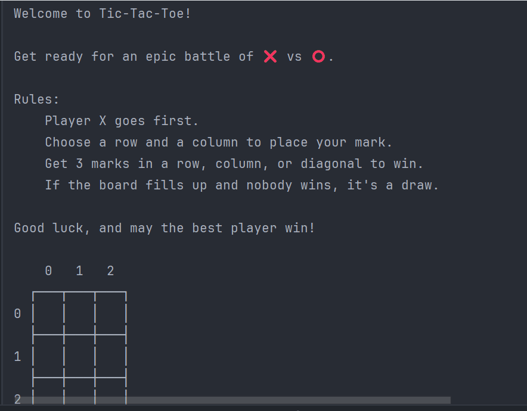

# Tic Tac Toe — Java Console Game


A console-based implementation of the classic **Tic Tac Toe (Three in a Row)** game developed in Java.

Two players take turns placing their marks (**X** and **O**) on a 3x3 board. The first player to align three marks horizontally, vertically, or diagonally wins the game. If all cells are occupied and no player wins, the game ends in a draw.

---
## Demo


---

## Features

- Display an empty board at the start of the game
- Turn-based gameplay (❌ starts first)
- Input moves using row and column coordinates
- Validate occupied cells
- Detect winning conditions
- Detect draw situations
- Display the board after each move
- Unit tests for game logic

---

## Technologies

| Technology | Version |
|------------|----------|
| Java | 25 |
| Maven | 4.x |
| JUnit Jupiter | 6.1.0 |

---

## Project Structure

```text
src
├── main
│   └── java
│       ├── Main.java
│       ├── Game.java
│       ├── Board.java
│       └── Player.java
│
└── test
    └── java
        └── BoardTest.java
        └── PlayerTest.java
```

---

## Getting Started

### Clone the repository

```bash
git clone https://github.com/TicTacToe-Team2/TicTacToe#
```

### Navigate to the project

```bash
cd TicTacToe
```

### Run the application

```bash
mvn compile
mvn exec:java
```

Or simply run the `Main` class from your IDE.

---

## Game Rules

1. Player **X** starts the game.
2. Players take turns placing their mark.
3. A player wins by placing three marks:
    - Horizontally
    - Vertically
    - Diagonally
4. If the board is full and nobody wins, the game ends in a draw.

---

## Running Tests

Execute all tests with:

```bash
mvn test
```

---

## Team

Developed using **Mob Programming**.

* [Elena Almansa](https://github.com/elenaalmansacampos)
* [Viviana Andrango](https://github.com/alvi103-png)
* [Aïda García](https://github.com/AidaG91)
* [Rukayato Seidu](https://github.com/rseidu941-commits)
* [Rose Vaillant](https://github.com/rosana50factoria)

---

## Concepts Applied

- Object-Oriented Programming (OOP)
- Single Responsibility Principle (SRP)
- Conditionals
- Loops
- Scanner
- Multidimensional Arrays
- Unit Testing

---

## Future improvements

- Add console colors
- Add game logs
- Add ASCII animations
- Allow players to start a new game without restarting the application (play again loop)